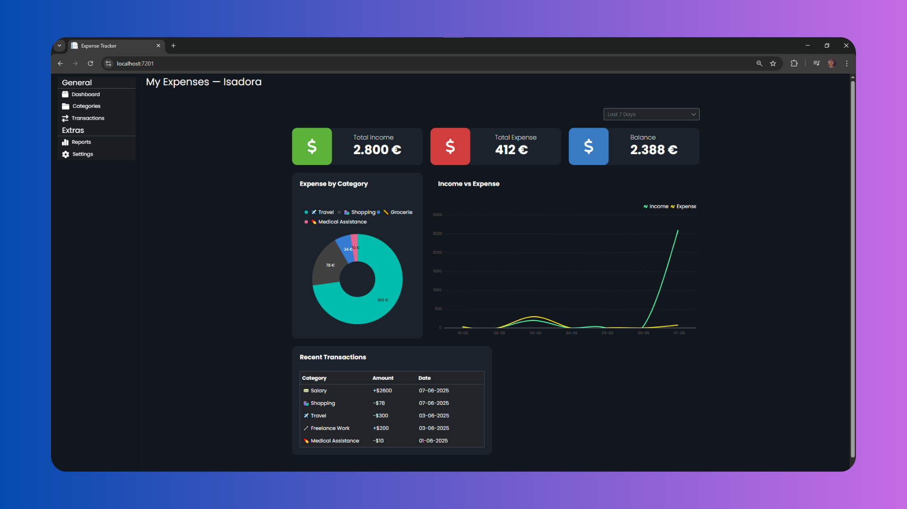

# 💰 Expense Tracker

Una aplicación web moderna y responsiva para el seguimiento de ingresos y gastos, construida con ASP.NET Core MVC.



## ✨ Características

- 📊 **Panel de control** con resumen de:
  - Ingresos totales
  - Gastos totales
  - Balance disponible
- 🧮 **Gráficas dinámicas**:
  - Pastel: gastos por categoría
  - Línea: ingresos vs gastos diarios
- 📁 Gestión de:
  - Categorías
  - Transacciones
- 📋 **Tabla de transacciones recientes**
- 🎨 Interfaz moderna con modo oscuro
- 📅 Filtro de transacciones por período (últimos 7 días, etc.)

## 🧰 Tecnologías

- ASP.NET Core
- [.NET 9](https://learn.microsoft.com/en-us/dotnet/core/dotnet-nine)
- SyncFusion — componentes UI modernos
- Entity Framework Core — persistencia de datos
- SQL Server — base de datos

## 🚀 Instalación

1. Clona el repositorio:

```bash
git clone [https://github.com/tuusuario/expense-tracker.git](https://github.com/codingisads/ExpenseTracker.git)
cd expense-tracker
```

2. Restaura paquetes e inicia la base de datos:

```bash
dotnet restore
dotnet ef database update
```

3. Ejecuta el proyecto:

```bash
dotnet run
```

4. Accede a la app en:

```
https://localhost:7201
```


## ✅ To-Do / Mejoras futuras

- Exportar reportes en PDF o Excel
- Modo multiusuario
- Categorías personalizables por usuario
- Notificaciones por email o SMS
- API REST pública para acceso externo

---

**Desarrollado con ❤️ por Isadora**
