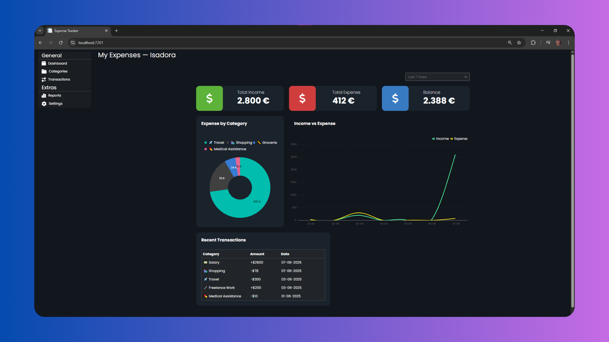

# 💰 Expense Tracker

A modern, responsive web application built with ASP.NET Core MVC to effortlessly track your income and expenses.



## ✨ Features

- 📊 **Comprehensive Dashboard**: Get a quick overview of your:
  - Total Income
  - Total Expenses
  - Available Balance
- 🧮 **Dynamic Visualizations**:
  - **Pie Charts:** Analyze your expenses by category.
  - **Line Charts:** Track daily income versus expenses.
- 📁 **Data Management**: Easily create, edit, and manage **Categories** and **Transactions**.
- 📋 **Recent Transactions**: Quick-view table for your latest financial activities.
- 🎨 **Modern UI**: Sleek, user-friendly interface complete with **Dark Mode**.
- 📅 **Smart Filtering**: Filter transactions by customized time periods (e.g., Last 7 Days, Last Month, etc.).

## 🧰 Tech Stack

- **Framework:** ASP.NET Core MVC
- **Runtime:** [.NET 9](https://learn.microsoft.com/en-us/dotnet/core/dotnet-nine)
- **UI Components:** SyncFusion
- **ORM / Data Access:** Entity Framework Core
- **Database:** SQL Server

## 🚀 Getting Started

### Prerequisites
Before you begin, ensure you have the following installed:
- [.NET 9 SDK](https://dotnet.microsoft.com/download/dotnet/9.0)
- SQL Server (or SQL Server Express)

### Installation Steps

1. **Clone the repository:**
   ```bash
   git clone [https://github.com/codingisads/ExpenseTracker.git](https://github.com/codingisads/ExpenseTracker.git)
   cd ExpenseTracker
